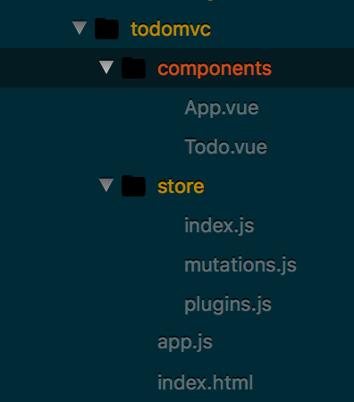

# 什么是Vuex？
这是我学习Vue的一大困惑，作为一个没有使用过React，redux的小白而言，这对我来说是一个全新的概念。我们先来看一下官方文档给出的解释：
>Vuex 是一个专为 Vue.js 应用程序开发的状态管理模式。它采用集中式存储管理应用的所有组件的状态，并以相应的规则保证状态以一种可预测的方式发生变化。

这段话一看就十分的官方，这对我们纯种小白来说无疑也是一种煎熬啊。怎么办呢？上网搜索通俗易懂的解释啊。在网上我找到了一个对我来说比较易懂的解释：前端的数据库。我们知道以前的前端所做的事情就是HTML+CSS+JS来写写样式，通过后端与服务器的操作来给前端提供数据支持。但是，社会在发展，人类在进步。如今前端不再仅仅局限于一个简易的网站，我们更想将它称为一个web应用。在构建大型应用时（虽然我目前还没有制作过什么大型应用），就会需要组件来切分应用的各个模块。这时我们就要思考一个问题，组件之间是可能有依赖关系，数据之间是可能要共享的，怎么管理这些数据呢？此时，就有了Vuex。将数据保存在一个大的Store(仓库)中，而你可以对这个Store进行操作。
# 怎么操作Store
首先先让我们记住2个关键点：

1.Store中状态改变，组件(*.vue)中的数据也会得到更新。

2.只能通过commit mutation来更改状态。

## Store的组成
state：状态，毫无疑问，就是管理共享数据的唯一数据源

getter：取数据，只能取而不能改变Store中的数据。

mutation：翻译为“突变”，回想第二个关键点，这个属性是唯一可以对Store中的数据进行修改的途径。但是，它是<b>同步</b>的。

action：现在数据更新那么频繁，同步得多慢，action便是一种异步操作，它可将状态提交给mutation而不能直接修改状态（第二个关键点）

module：使每个组件都拥有自己的一个状态库。

# 加深Vuex的状态管理概念————todomvc

## 项目结构


很明显，项目被分为组件，状态管理，主页三个部分。为了获取全局管理的状态我们只需要的app.js中如下书写：
``` javascript
new Vue({
    //...
    store,//将状态分配到各个组件中
    //...
})
```
此时假设我们需要在App.vue中获取Store中的状态该如何：
``` javascript
computed: {
    todos () {
      return this.$store.state.todos
    },
    //...
  }
```
通过computed可以来跟踪Store中状态的变化，this.$store可以获取全局状态。

接着我们再将视线转向Store，创建一个仓库的方法如下所示：
``` javascript
import Vue from 'vue'
import Vuex from 'vuex'
import { state, mutations } from './mutations'
import plugins from './plugins'

Vue.use(Vuex)

export default new Vuex.Store({
  state,
  mutations,
  plugins
})

```
此时我们将数据的状态state、突变mutation放到mutation.js文件中，plugins在这个demo中是用来进行localStorage的本地存储的。是不是一目了然？

我们知道mutation是用来修改state的，在这个demo中，我们只有一个模块那就是todolist。虽然没有多个模块，但是无疑我们已经涉及module这个概念了。
``` javascript
export const STORAGE_KEY = 'todos-vuejs'

// for testing
if (navigator.userAgent.indexOf('PhantomJS') > -1) {
  window.localStorage.clear()
}
//状态
export const state = {
  todos: JSON.parse(window.localStorage.getItem(STORAGE_KEY) || '[]')
}
```
会造成数据的修改的方法均包含在mutations对象中：
``` javascript
export const mutations = {
    //添加todo
  addTodo (state, { text }) {
    state.todos.push({
      text,
      done: false
    })
  },
  //删除todo
  deleteTodo (state, { todo }) {
    state.todos.splice(state.todos.indexOf(todo), 1)
  },
    //折叠todo
  toggleTodo (state, { todo }) {
    todo.done = !todo.done
  },
    //编辑todo
  editTodo (state, { todo, value }) {
    todo.text = value
  },
    //折叠所有
  toggleAll (state, { done }) {
    state.todos.forEach((todo) => {
      todo.done = done
    })
  },
    //清除完成的todo
  clearCompleted (state) {
    state.todos = state.todos.filter(todo => !todo.done)
  }
}
```

有了这些数据修改的方法，我们怎么在组件中进行更改呢？
``` javascript
methods: {
    addTodo (e) {
      var text = e.target.value
      if (text.trim()) {
        this.$store.commit('addTodo', { text })
      }
      e.target.value = ''
    },
    ...mapMutations([
      'toggleAll',
      'clearCompleted'
    ])
  }
```
仔细看这个method，addTodo commit(mutations)之后还要将输入框置为空，所以没有用映射。而其余则采用...mapMutations辅助函数进行映射。

# 总结
至此，我通过一个vuex的官方例子，解释了vuex管理组件件数据存储，更改的方法，鉴于这只是一篇梳理概念的文章，所以不会对具体的API做进一步解释。相信多做几个项目自然就会熟悉的吧？


# 参考文章
[Vuex，从入门到入门](https://zhuanlan.zhihu.com/p/24357762)

[Vuex官方文档](https://vuex.vuejs.org/zh-cn/)

[Vuex官方例子](https://github.com/vuejs/vuex/tree/783459bedbbc6abfa61396f820b295016e33f692/examples)
